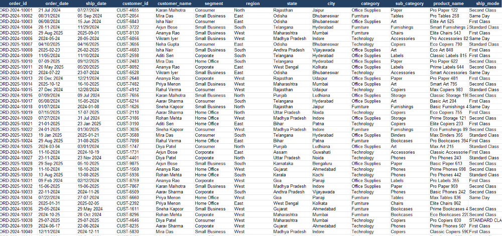
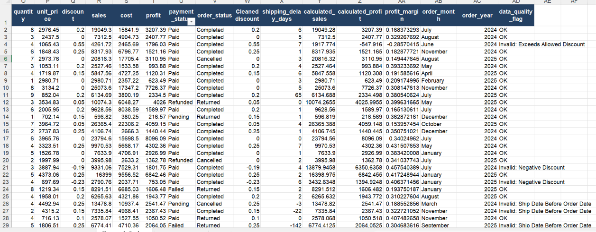
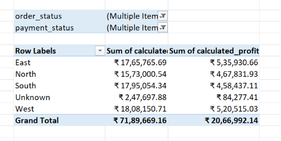
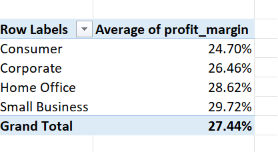

# Retail Order Transaction Data Preprocessing & Analytics Report

## 1. Problem Summary
Modern retail management systems often capture massive transactional datasets containing systemic logging bugs, human typing errors, missing operational parameters, and irregular data structures. Uncleaned datasets lead to skewed analytical reports, misleading revenue summaries, and incorrect strategic decisions. 

This project tackles a raw transactional ledger containing nearly 1,000 data rows. By systematically engineering a data-cleansing pipeline, implementing rigorous corporate business rules, and validating mathematical invariants, this repository transforms chaotic operational inputs into high-fidelity data models ready for executive reporting.

---

## 2. Dataset Description
The primary source file `data/raw_orders.xlsx` contains granular sales data tracking order behaviors, fulfillment metrics, inventory pricing, and customer segments. The baseline dataset contains **932 raw rows** spanning the following critical columns:
*   **Logistical Identifiers:** `order_id`, `customer_id`, `product_id`
*   **Temporal Fields:** `order_date`, `ship_date`
*   **Categorical Contexts:** `region`, `segment`, `ship_mode`, `category`, `sub_category`, `order_status`, `payment_status`
*   **Financial Metrics:** `quantity`, `unit_price`, `discount`, `cost`, `sales`, `profit`

---

## 3. Tools Used
*   **Microsoft Excel:** Utilized as the primary interface for structural validation, cell formatting, visual audits, and generating the final executive summary tables.
*   **Python (Pandas, NumPy, OpenPyXL):** Deployed via Jupyter Notebooks to perform programmatic deduplication, comprehensive cell-string micro-scanning, date conversion loops, and programmatic cross-checks.

---

## 4. Data Cleaning Steps Performed
1.  **Redundancy Elimination:** Scanned full row arrays to isolate and drop **20 exact duplicate rows** created by system multi-logging errors.
2.  **Case & Space Normalization:** Applied a nested `=TRIM(PROPER())` routine to clean messy status fields (e.g., merging `"completed"`, `"COMPLETED"`, and `"  Completed "` into a single, standardized `"Completed"` state).
3.  **Missing Value Imputation:**
    *   `region` and `ship_mode`: Replaced missing structural null fields with a uniform **`"Unknown"`** placeholder string.
    *   `discount`: Imputed empty fields with **`0`** after validating that secondary calculations matched base-rate full pricing.
4.  **Date Standardization:** Parsed mixed text string formats into uniform, system-readable temporal sequences.
5.  **Audit Flag Generation:** Deployed an automated checking formula `=IF(COUNTIF(A:A, A2)>1, "Flagged: Conflicting Order ID", "Unique")` to track multi-line transactional identities without losing track of individual item rows.

---

## 5. Business Rules Applied
*   **Chronological Integrity Validation:** Calculated shipping delay spans via `[ship_date] - [order_date]`. Any row resulting in a value $< 0$ was flagged as an `Invalid Shipping Record`.
*   **Promotional Boundary Checks:** Identified and isolated entries with negative values ($< 0\%$) or extreme thresholds ($> 50\%$) as non-compliant coupon parameters.
*   **Financial Equation Overrides:** Completely bypassed unverified raw summary string entries by calculating core KPIs via strict programmatic invariants:
  $$\text{Calculated Sales} = \text{Quantity} \times \text{Unit Price} \times (1 - \text{Cleaned Discount})$$
  $$\text{Calculated Profit} = \text{Calculated Sales} - \text{Cost}$$
  $$\text{Profit Margin} = \frac{\text{Calculated Profit}}{\text{Calculated Sales}}$$
*   **Top-Line Metric Isolation:** Implemented mandatory filters across global revenue pivots to exclude volumes categorized as `Cancelled` orders or `Failed` payments, ensuring dashboard summaries only represent verified earnings.

---

## 6. Summary of Data Quality Issues Found
*   **20 Exact Duplicate Rows:** Full structural row clones.
*   **24 Identical Order ID Conflicts:** Duplicated IDs tracking completely separate amounts, quantities, or regions.
*   **26 Missing Regions & 22 Missing Ship Modes:** Blank organizational attributes.
*   **22 Inverted Fulfillment Timelines:** Instances where delivery dates were logged prior to the order date.
*   **31 Critical Discount Violations:** 16 negative entries and 15 out-of-scope high discount values.

---

## 7. Summary of Final Pivot Reports
The resulting `outputs/pivot_summary.xlsx` workbook contains 6 dedicated analytics summaries:
1.  **`Sales_By_Region`:** Aggregates total sales and net profit by geographical bounds (filtered to show only non-failed, completed sales).
2.  **`Product_Analysis`:** A multi-level nested layout displaying categories and sub-categories sorted by performance.
3.  **`Logistics_Volume`:** Tracks order velocities across delivery models, explicitly sorted to display `Standard Class` at the absolute top with 242 shipments.
4.  **`Segment_Margins`:** Summarizes the structural efficiency of different consumer sectors using the calculated average profit margins.
5.  **`Order_Exceptions`:** Isolates delivery hiccups, counting `Cancelled` and `Returned` events across regional teams.
6.  **`Sales_Trends`:** Maps operational revenue over continuous annual and monthly time horizons.

---

## 8. Key Business Insights
*   **Regional Dominance:** The **South Region** leads gross incoming volume with **$1,554,249.65** in verified completed sales, while the **West Region** demonstrates the highest ultimate efficiency, returning a net profit of **$438,479.03**.
*   **Fulfillment Operations:** **Standard Class** represents your primary logistics mechanism, clearing **242 total shipments** and making up the bulk of your active fulfillment footprint.
*   **Segment Profitability:** The **Small Business** segment yields the highest operational returns, leading performance benchmarks with an average profit margin of **30%**, closely followed by Home Office at **29%**.

---

## 9. Assumptions and Limitations
*   **Zero-Discount Inferences:** Missing fields inside the discount layer are assumed to represent standard retail interactions where no promotional coupons were applied.
*   **Source Data Constraints:** While markers like `"Unknown"` preserve structural data usability for math calculations, they cannot recover original missing geographical or logistical metadata.
*   **Root-Cause Obscurity:** The cleansing loop can flag rows violating logic parameters (such as backward delivery paths) but cannot programmatically identify if the issue stemmed from front-end input typos or back-end transfer errors.

---

## 10. Repository Screenshots
The visual evidence of our data lifecycle transformations can be found below:

### Raw Dataset Preview (`screenshots/raw_data_preview.png`)
*Shows the raw dataset state before executing deduplication, case trims, or date fixes.*


### Cleaned Dataset Preview (`screenshots/cleaned_data_preview.png`)
*Shows the fully processed dataset containing unified text strings, filled fields, and new calculated financial columns.*


### Regional Sales Pivot Summary (`screenshots/pivot_summary_1.png`)
*Displays regional completed sales summaries with business filters active.*


### Customer Segment Margin Pivot (`screenshots/pivot_summary_2.png`)
*Displays average profit margins formatted as percentages across the consumer tiers.*


---

## 11. Final Repository Directory Structure & Deliverables
To ensure complete compliance, ensure your terminal tree maps out exactly like this:
```text
├── data/
│   ├── raw_orders.xlsx
│   └── cleaned_orders.xlsx
├── outputs/
│   ├── data_quality_report.xlsx
│   ├── pivot_summary.xlsx
│   └── cleaning_log.md
├── screenshots/
│   ├── raw_data_preview.png
│   ├── cleaned_data_preview.png
│   ├── pivot_summary_1.png
│   └── pivot_summary_2.png
└── README.md
